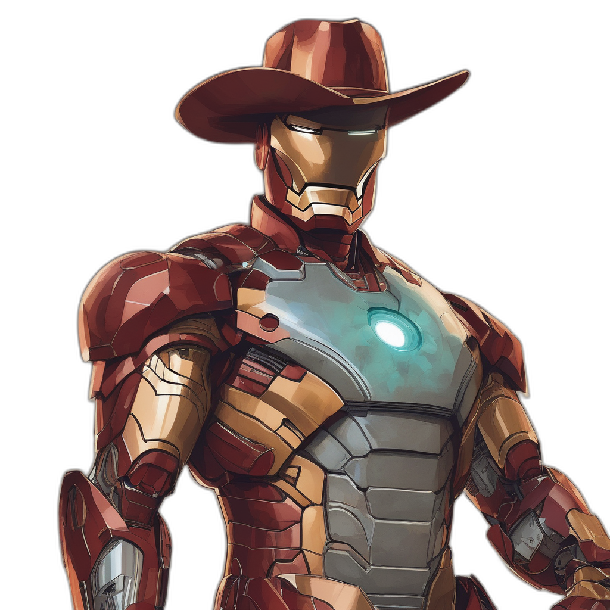

# Sticker Generator with Stable Diffusion

This project is a sticker generator built using stable diffusion, allowing users to create unique stickers based on textual prompts. It leverages the power of the Stable Diffusion XL model for image generation and provides a streamlined process for converting generated images into stickers.

<p align="center">
  
  <h5 align="center">"iron man wearing a cowboy hat"</h3>
</p>

## Features

- Text Prompt Input: Users can input textual prompts to generate images.
- Stable Diffusion Model: Utilizes the Stable Diffusion XL model for high-quality image generation.
- Sticker Creation: Converts generated images into stickers with customizable overlays.
- Easy-to-Use Interface: Simple command-line interface for generating stickers.

## Installation

Clone the repository:
```bash
git clone https://github.com/shekharkalshetti/sticker-generator.git

```
Install dependencies::
```bash
pip install -r requirements.txt

```

## Usage
Run the main.py script:
```bash
python main.py

```

## Project Structure

- **main.py**: Entry point of the project. Handles user interaction and coordinates image generation and sticker creation.
- **diffusion.py**: Module for interacting with the Stable Diffusion XL model and generating images from textual prompts.
- **sticker_utils.py**: Utility functions for processing images and creating stickers.

## Acknowledgement
- [Stablility AI](https://huggingface.co/stabilityai/stable-diffusion-xl-base-1.0) for the Stable Diffusion XL model implementation.

